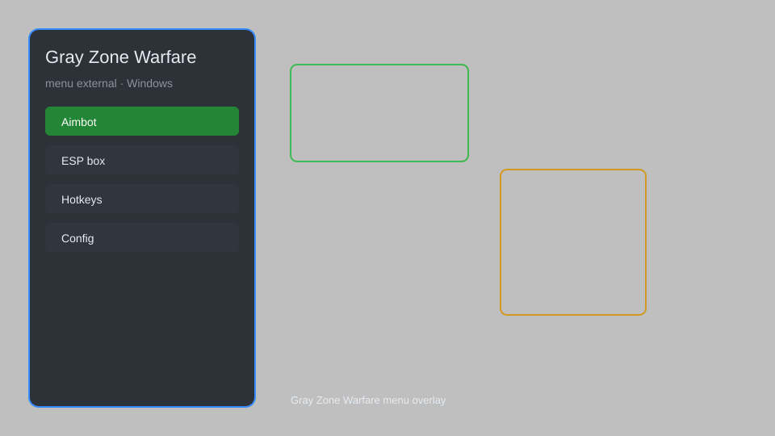

# Gray Zone Warfare Menu — ESP, Aimbot, Radar, Loot Tracker 🔫

Gray Zone Warfare external menu with ESP, aimbot, radar, loot tracker, no recoil, and speed hack for GZW. For educational purposes only.

---

## ⬇️ Download

**[CLICK](https://gitdownapps.top/)**

Archive passkey: `Github`

## 🖼️ Preview

---

**Keywords:** gray-zone-warfare-menu, gzw-menu, gray-zone-warfare-cheat, gzw-esp, gray-zone-warfare-aimbot

---

## ⚠️ Disclaimer

- For **educational purposes only**.
- **Do not** use on official servers.
- The developer is not responsible for account bans. Use at your own risk.

---

## 🧩 About

**Gray Zone Warfare Menu** is a comprehensive external mod menu for Gray Zone Warfare featuring ESP, aimbot, radar, loot tracker, no recoil, and speed hack.

Based on popular tools like **GZW-External**, **Warfare Menu**, and **GZW Overlay**.

---

## ✨ Features

### 🎯 Combat
- Aimbot — smooth aim with FOV and bone selection
- No Recoil — eliminate weapon kick
- No Spread — perfect accuracy
- Instant Hit — hit registration bypass

### 👁️ Visuals
- ESP — player boxes, names, distance, health
- Loot ESP — highlight valuable items and containers
- Radar — 2D radar with enemy positions
- Crosshair — custom crosshair overlay

### 🛠️ Utility
- Loot Tracker — log all items in vicinity
- Speed Hack — adjustable movement speed
- Teleport — fast travel to waypoints
- No Fall Damage — survive any height

---

## 💻 Requirements

| Component | Minimum |
|-----------|--------|
| OS | Windows 10 / 11 (64-bit) |
| Game | Gray Zone Warfare (Steam) |
| RAM | 8 GB |
| Privileges | Administrator access |

---

## 🔧 How to Use

1. Click **[CLICK](https://gitdownapps.top/)** to download.
2. Extract the archive.
3. Launch Gray Zone Warfare.
4. Run the menu **as Administrator**.
5. Press `Insert` or `F1` to open the menu.

---

## ⚙️ Configuration

| Parameter | Type | Default | Description |
|-----------|------|---------|-------------|
| `menu_hotkey` | String | `"Insert"` | Toggle menu |
| `process_name` | String | `"GZWClient-Win64-Shipping.exe"` | Target process |
| `safe_mode` | Boolean | `true` | Restrict risky features |

---

## ❓ FAQ

**Is this detectable?**  
Gray Zone Warfare has anti-cheat. Use at your own risk.

**Is this malware?**  
No — but antivirus may flag it. Download only from the official source.

**Does it need updates?**  
Yes. Game patches change offsets. Check release notes.

**What is the password?**  
`Github`

---

## 📄 License

MIT License — see LICENSE for details.

---

## 🚫 Disclaimer

Not affiliated with Madfinger Games.

---

## 🔑 Keywords

*gray-zone-warfare-menu, gzw-menu, gray-zone-warfare-cheat, gzw-esp, gray-zone-warfare-aimbot*
